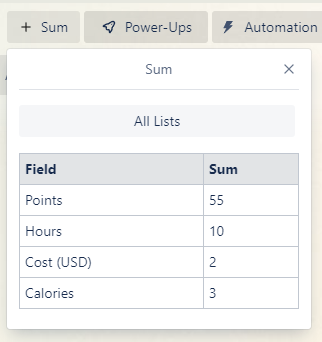
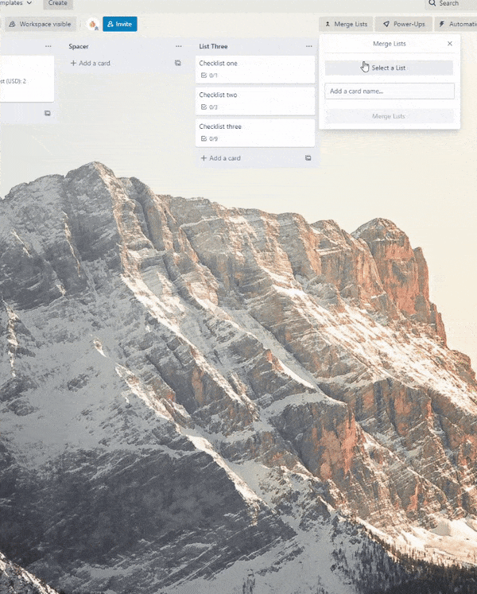

# Overview

This project is a container for several Trello power-ups. Each power-up is loaded by calling their respective route while sharing some common components and helpers for things like storage or REST API access. The project makes use of both Trello's REST API and client libraries. You can read more about them here: 

 - [Power-ups](https://developer.atlassian.com/cloud/trello/power-ups/)
 - [REST API Client](https://developer.atlassian.com/cloud/trello/guides/client-js/getting-started-with-client-js/)

# Power-ups
At the moment, there are two power-ups contained within this app: Sums & Merge Lists. 

## Sums
The sums power-up provides users with a method for summing the number-based custom field values from a specific list or the entire board. This one is useful for things like time tracking, costs or points. The power-up's implementation is very simple as we can access and process all data using the power-up client.

## Merge Lists
The merge lists power-up provides a board button that allows users to combine checklists from a specific card list or the entire board. I've found this power-up very useful for creating grocery lists. You can see a demonstration below where we are merging three cards together. This power-up requires authorisation to use the REST API on behalf of the user as we cannot access checklists or create cards from the base power-up client. As we need to manage authorisation this power-up uses several of the standard authorisation capabilities such as: `remove-data`, `authorization-status` & `show-authorization`.

# Development
I am open to any PR's if you'd like to improve a core functionality or fix any issues you've found. However, I would like to keep both power-ups as lean as possible so if you've found a use case that these don't quite fit we could consider a new power-up entirely. 

The app is written in React (CRA) and leverages [Typescript](https://www.typescriptlang.org/), [Styled-Components](https://styled-components.com/) & [React Router V6](https://reactrouter.com/docs/en/v6/getting-started/overview). There is also a configuration for ESLint & Prettier, however, there is no CI, so you'll need to configure that in your own IDE or run it manually. 

For testing, we can use [ngrok](https://ngrok.com/) to tunnel into your local build. This means you don't have to deploy your changes any time you want to test.

To get started with development:
1. Clone the project & run `npm i` to install the required dependencies.
2. Access your developer API key [here](https://trello.com/app-key).
3. Create a local environment file (.env.development.local) in the root directory of the project and add the following: `REACT_APP_TRELLO_KEY={YOUR-API-KEY-GOES-HERE}`.
4. Start the project with `npm run start` & wait for it to load.
5. Start ngrok with `npm run serve` (You may need to login to a free ngrok account for this).
6. You should now have a public url that looks something like this: `https://XXXX-XXX-XX-XX-XXX.ngrok.io`.
7. Add this to your allowed origins [here](https://trello.com/app-key). Keep in mind that you'll need to update this every time you restart ngrok.
8. Create a new power-up for each that you want to develop through your own Trello account [here](https://trello.com/power-ups/admin). The Iframe connector URL is the ngrok link from above appended with the power-up's route. For example the sums power-up would be `https://XXXX-XXX-XX-XX-XXX.ngrok.io/sums`. If you don't want to create several power-ups for development, you can just change the iFrame connector URL each time you want to start working on a new power-up.
9. Open the Capabilities tab and select the power-up's required capabilities. You can find these in the power-ups entry point, e.g. sums is in `src/power-ups/sums/Sums.tsx`.
12. You should now be able to add each power up to your Trello board and get started.
